# Multi-Cloud VM Vulnerability Scanning with Qualys QScanner

## The Problem

Your security team needs vulnerability data across all cloud VMs. Traditional approaches require:

- Installing agents on every VM
- Managing agent versions across AWS, Azure, and GCP
- Hoping nothing falls through the cracks

**This solution**: Deploy once per cloud, scan automatically, get results in Qualys.

## How It Works

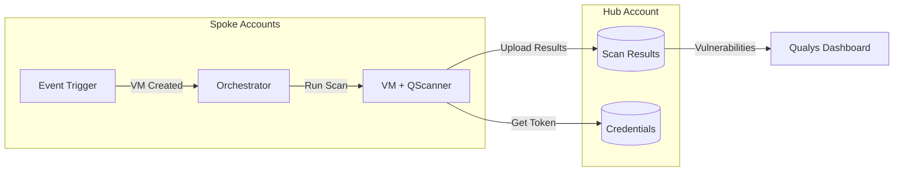

## Cloud-Native Implementation

Each cloud uses its native services - no third-party tools required.

```mermaid
flowchart TB
    subgraph AWS
        EB["EventBridge"] --> SF["Step Functions"]
        SF --> SSM["SSM Run Command"]
        SSM --> EC2["EC2"]
    end

    subgraph Azure
        EG["Event Grid"] --> AF["Azure Functions"]
        AF --> AA["Automation Account"]
        AA --> AVM["VM"]
    end

    subgraph GCP
        AL["Audit Logs"] --> PS["Pub/Sub"]
        PS --> CF["Cloud Functions"]
        CF --> OSC["OS Config Agent"]
        OSC --> GCE["Compute Engine"]
    end
```

## What You Get

QScanner performs three scan types in a single pass:

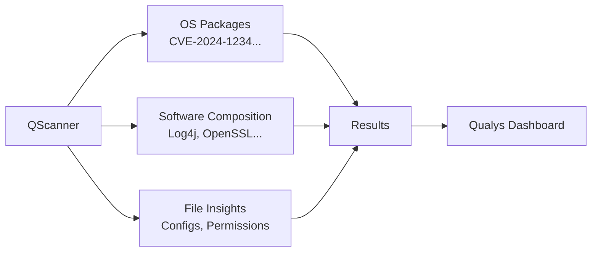

| Scan Type | What It Finds | Example |
|-----------|---------------|---------|
| **OS** | Package vulnerabilities | CVE-2024-1234 in openssl-1.1.1 |
| **SCA** | Library vulnerabilities | Log4Shell in log4j-2.14.0.jar |
| **FileInsight** | Misconfigurations | World-readable /etc/shadow |

## Deployment Flow

### 1. Deploy Hub (Once)

Central account stores credentials and collects results.

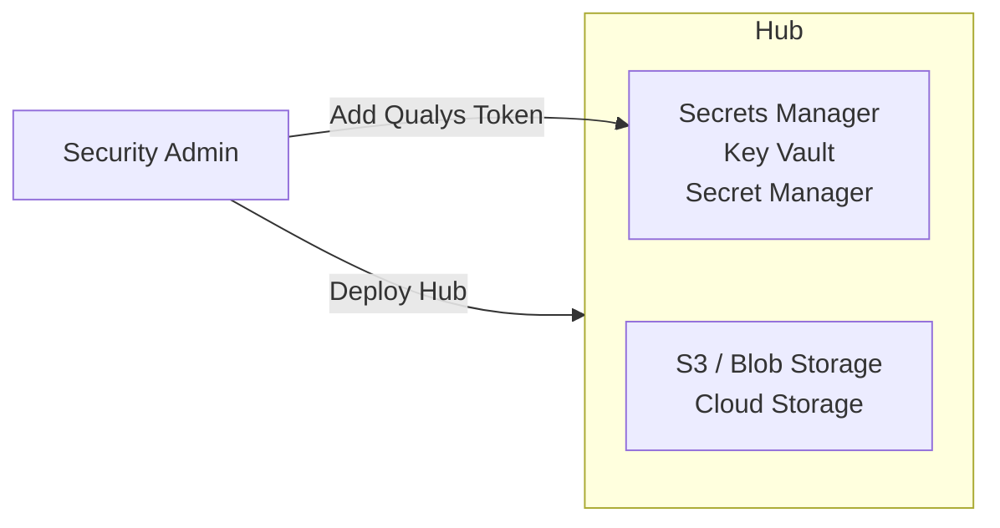

### 2. Deploy Spokes (Per Account)

Lightweight deployment triggers scans and reports back.

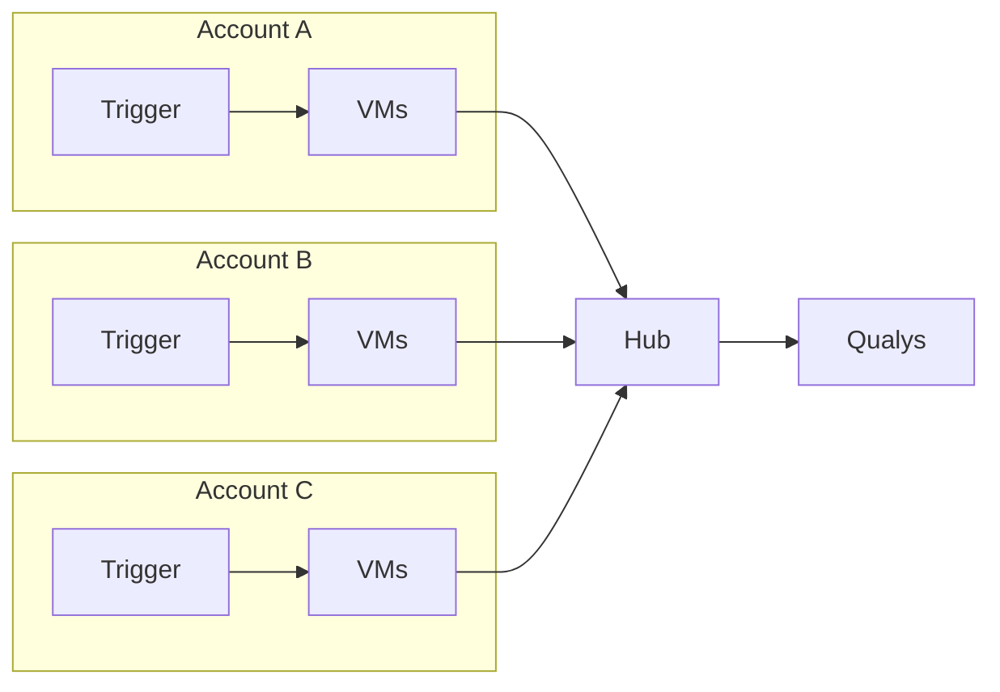

## Scan Triggers

Two automatic triggers ensure coverage:

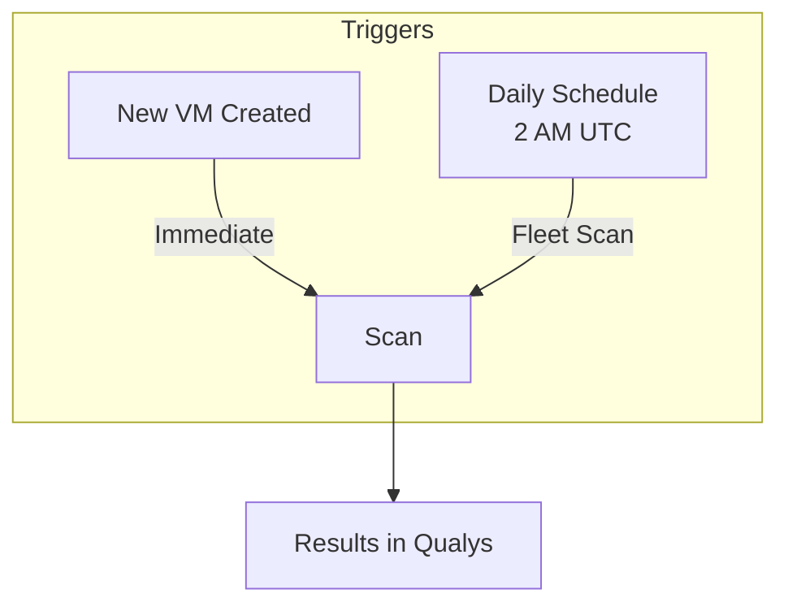

---

## End-to-End: AWS

### Architecture Deep Dive

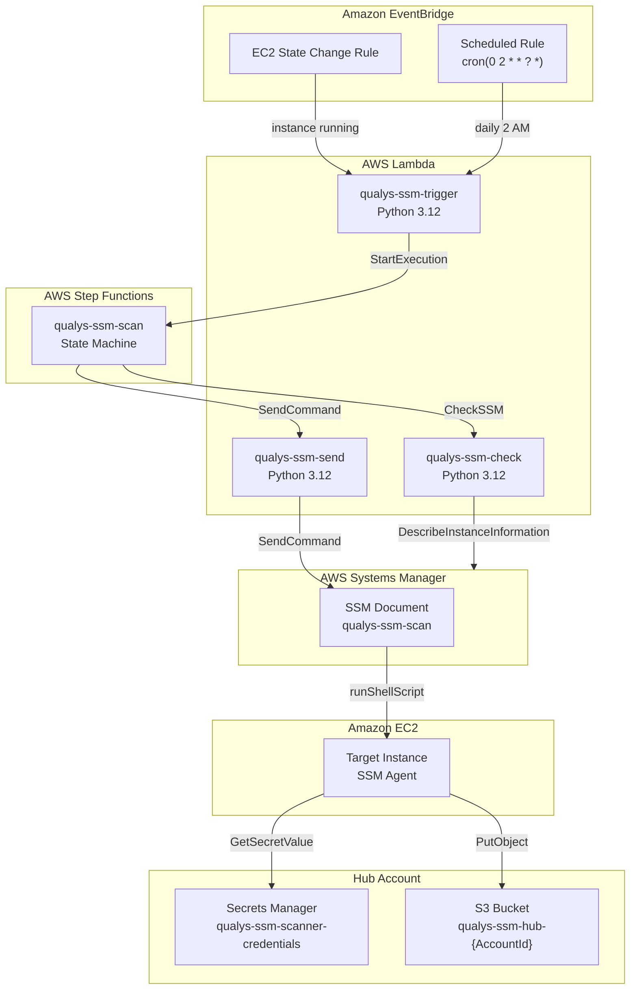

### Sequence Diagram

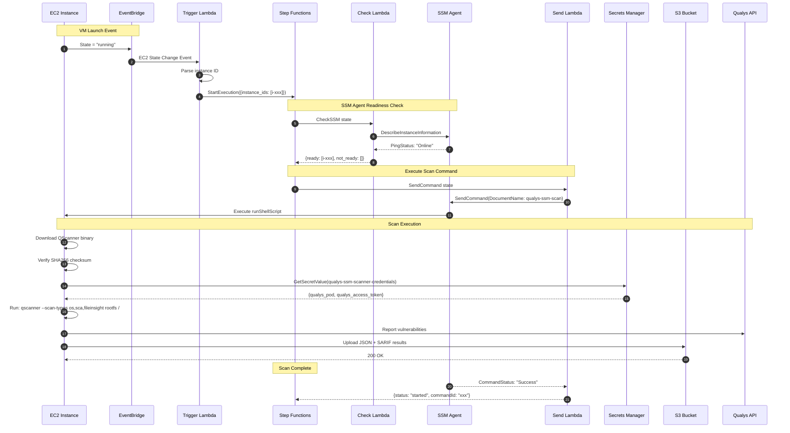

### Key AWS Resources

| Resource | Type | Purpose |
|----------|------|---------|
| `qualys-ssm-trigger` | Lambda Function | Parses events, starts Step Function |
| `qualys-ssm-check` | Lambda Function | Polls SSM agent readiness |
| `qualys-ssm-send` | Lambda Function | Invokes SSM Run Command |
| `qualys-ssm-scan` | Step Function | Orchestrates check → wait → send flow |
| `qualys-ssm-scan` | SSM Document | Shell script for QScanner execution |
| `qualys-ssm-new-ec2` | EventBridge Rule | Triggers on EC2 running state |
| `qualys-ssm-scheduled` | EventBridge Rule | Daily fleet scan at 2 AM UTC |

### SSM Document Execution

The SSM Document runs this workflow on the EC2 instance:

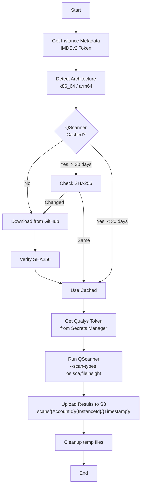

---

## End-to-End: Azure

### Architecture Deep Dive

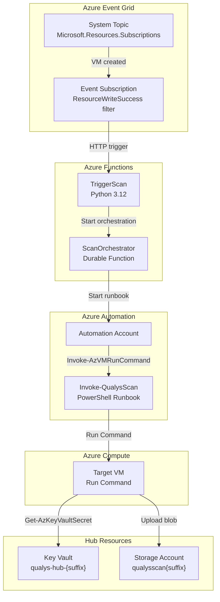

### Sequence Diagram

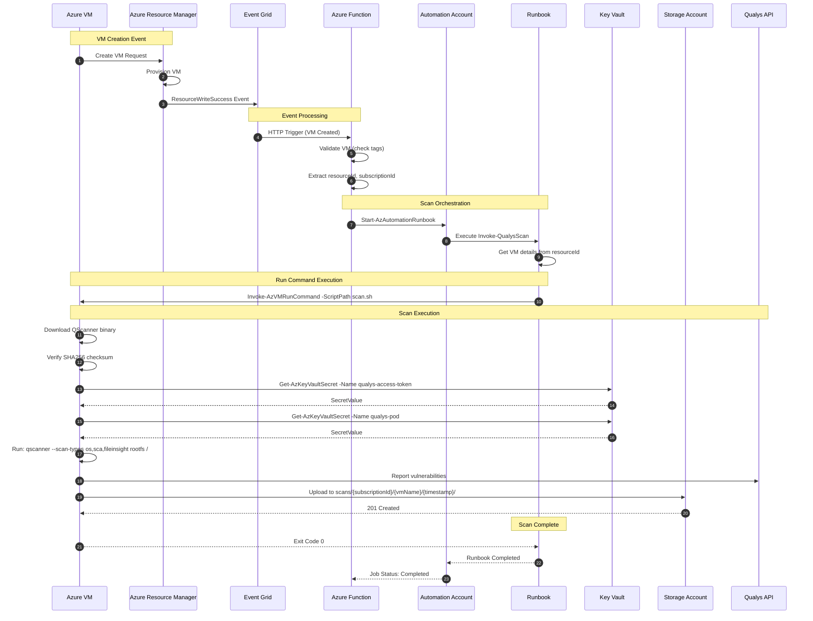

### Key Azure Resources

| Resource | Type | Purpose |
|----------|------|---------|
| `qualys-scan-{suffix}` | Function App | Serverless compute, Python 3.12 |
| `TriggerScan` | Function | HTTP trigger from Event Grid |
| `qualys-automation-{suffix}` | Automation Account | Hosts runbooks for VM execution |
| `Invoke-QualysScan` | Runbook | PowerShell script invoking Run Command |
| `qualys-vm-events-{suffix}` | Event Grid System Topic | Captures subscription-level events |
| `new-vm-trigger` | Event Subscription | Filters for VM creation events |
| `qualys-hub-{suffix}` | Key Vault | Stores Qualys credentials |
| `qualysscan{suffix}` | Storage Account | Blob storage for scan results |

### Event Grid Filter

The Event Grid subscription filters for VM creation:

```json
{
  "includedEventTypes": ["Microsoft.Resources.ResourceWriteSuccess"],
  "advancedFilters": [
    {
      "key": "data.resourceProvider",
      "operatorType": "StringEquals",
      "values": ["Microsoft.Compute"]
    },
    {
      "key": "data.operationName",
      "operatorType": "StringContains",
      "values": ["Microsoft.Compute/virtualMachines/write"]
    }
  ]
}
```

### Managed Identity Flow

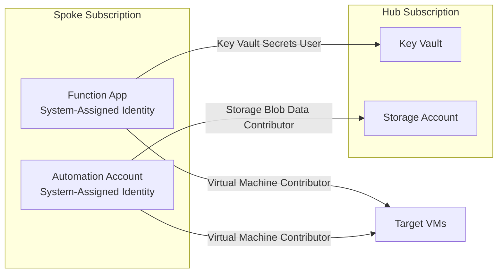

---

## End-to-End: GCP

### Architecture Deep Dive

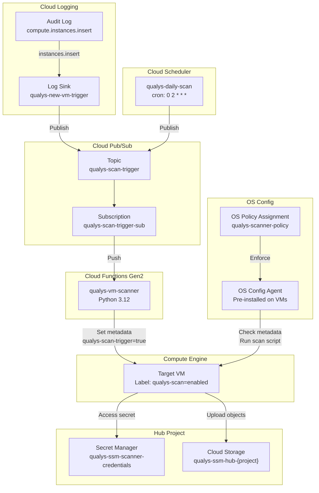

### Sequence Diagram

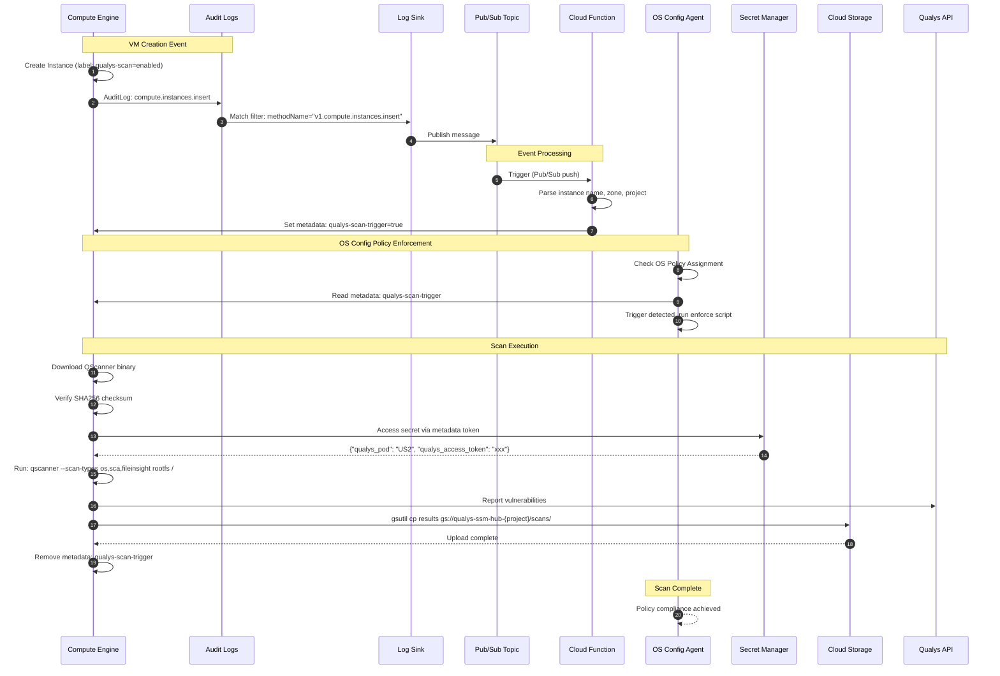

### Key GCP Resources

| Resource | Type | Purpose |
|----------|------|---------|
| `qualys-vm-scanner` | Cloud Function Gen2 | Serverless compute, Python 3.12 |
| `qualys-scanner-policy` | OS Policy Assignment | Executes scan script on VMs |
| `qualys-scan-trigger` | Pub/Sub Topic | Event messaging |
| `qualys-scan-trigger-sub` | Pub/Sub Subscription | Delivers messages to function |
| `qualys-new-vm-trigger` | Log Sink | Routes audit logs to Pub/Sub |
| `qualys-daily-scan` | Cloud Scheduler Job | Daily fleet scan at 2 AM UTC |
| `qualys-scanner` | Service Account | Cross-project access |
| `qualys-ssm-scanner-credentials` | Secret Manager Secret | Stores Qualys credentials |
| `qualys-ssm-hub-{project}` | Cloud Storage Bucket | Stores scan results |

### Log Sink Filter

The log sink captures VM creation events:

```
resource.type="gce_instance"
protoPayload.methodName="v1.compute.instances.insert"
protoPayload.response.status="RUNNING"
```

### Service Account Permissions

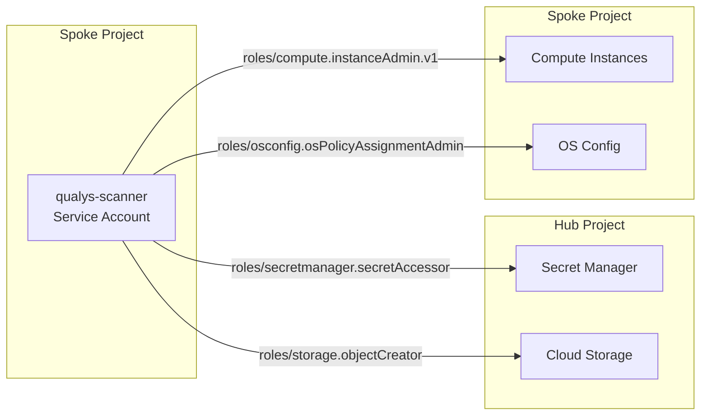

### Cloud Function Environment

```python
# Environment variables set on Cloud Function
HUB_PROJECT_ID   = "security-hub-project"
HUB_BUCKET_NAME  = "qualys-ssm-hub-security-hub-project"
HUB_SECRET_ID    = "qualys-ssm-scanner-credentials"
SCAN_TYPES       = "os,sca,fileinsight"
PROJECT_ID       = "workload-project-123"
```

---

## Quick Start

**AWS:**
```bash
# Set credentials
export QUALYS_ACCESS_TOKEN="your-token"

# Deploy hub (security account)
make aws-deploy-hub ORG_ID=o-xxxxx

# Deploy spokes (org-wide via StackSet)
make aws-deploy-stackset-instances OU_IDS=ou-xxxxx
```

**Azure:**
```bash
# Set credentials
export QUALYS_ACCESS_TOKEN="your-token"

# Deploy hub
make azure-deploy-hub AZURE_RESOURCE_GROUP=qualys-hub-rg

# Deploy spoke
HUB_SUBSCRIPTION_ID=xxx \
HUB_RESOURCE_GROUP=qualys-hub-rg \
HUB_STORAGE_ACCOUNT=qualysscanxxx \
HUB_KEY_VAULT=qualys-hub-xxx \
make azure-deploy-spoke AZURE_RESOURCE_GROUP=qualys-spoke-rg
```

**GCP:**
```bash
# Set credentials
export QUALYS_ACCESS_TOKEN="your-token"

# Deploy hub
make gcp-deploy-hub GCP_PROJECT=security-hub-project

# Deploy spoke
HUB_PROJECT_ID=security-hub-project \
HUB_BUCKET_NAME=qualys-ssm-hub-security-hub-project \
HUB_SECRET_ID=qualys-ssm-scanner-credentials \
make gcp-deploy-spoke GCP_PROJECT=workload-project
```

## Results in Qualys

Within minutes of VM launch, you'll see:

- **Asset inventory** with cloud metadata (instance ID, region, account/subscription/project)
- **Vulnerability findings** mapped to CVEs with severity scores
- **Software inventory** including transitive dependencies
- **Compliance data** from file and configuration analysis

## Why This Approach

| Traditional Agent | This Solution |
|-------------------|---------------|
| Install on every VM | Deploy once per account |
| Always running | On-demand only |
| Update agents everywhere | Update hub only |
| Miss VMs without agent | Event-driven, automatic |
| Different per cloud | Same pattern everywhere |

## Security Model

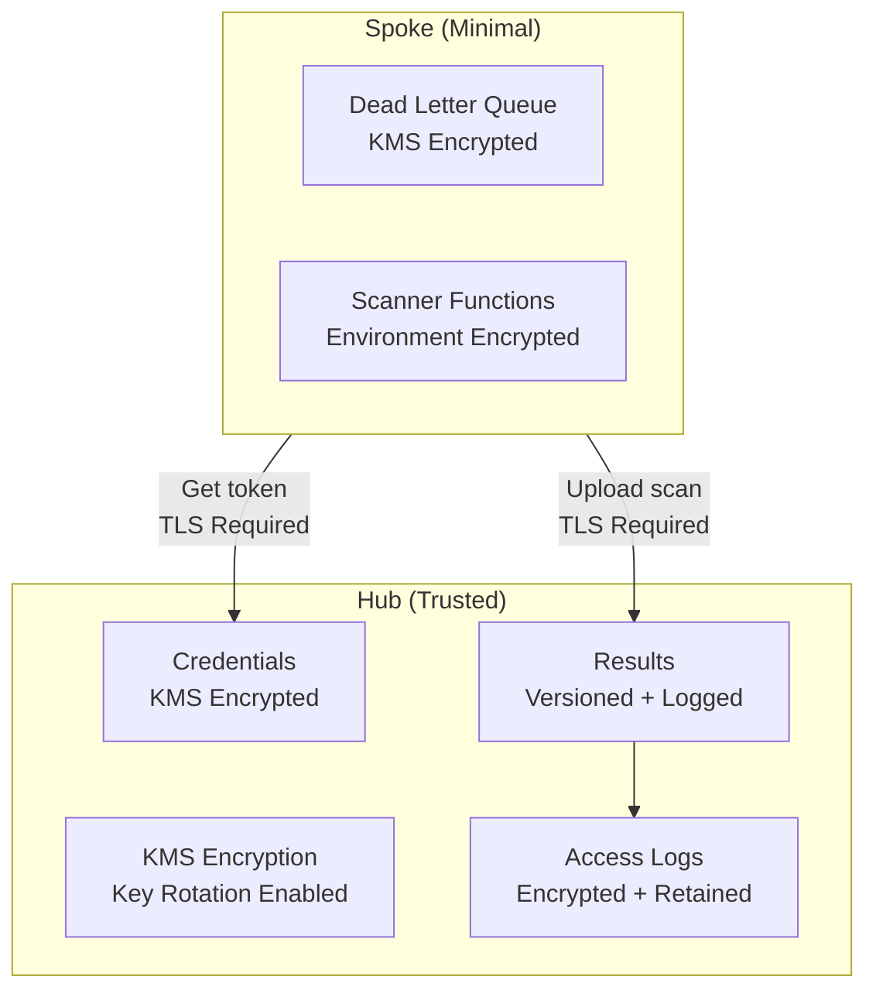

### Encryption at Rest

| Cloud | Resource | Encryption |
|-------|----------|------------|
| **AWS** | S3 Buckets | KMS with customer-managed key, key rotation enabled |
| **AWS** | Secrets Manager | KMS with customer-managed key |
| **AWS** | SQS (DLQ) | KMS encryption |
| **AWS** | Lambda Environment | KMS encryption for environment variables |
| **Azure** | Storage Account | GRS replication, TLS 1.2 minimum |
| **Azure** | Key Vault | Purge protection enabled, 90-day soft delete |
| **GCP** | Cloud Storage | Google-managed encryption, versioning enabled |
| **GCP** | Secret Manager | Automatic encryption with auto-replication |

### Network Security

| Cloud | Control | Implementation |
|-------|---------|----------------|
| **AWS** | Transport | TLS required via bucket policy (`aws:SecureTransport`) |
| **AWS** | VPC Support | Optional VPC configuration for Lambda functions |
| **AWS** | Cross-Account | Organization-scoped access via `aws:PrincipalOrgID` |
| **Azure** | Network Rules | Storage and Key Vault default deny, Azure Services bypass |
| **Azure** | Public Access | Disabled on storage accounts and Key Vault |
| **Azure** | Function Ingress | HTTPS only, HTTP/2 enabled, FTPS disabled |
| **GCP** | Public Access | `public_access_prevention = enforced` on all buckets |
| **GCP** | Function Ingress | `ALLOW_INTERNAL_AND_GCLB` restricts external access |

### Access Controls

| Cloud | Control | Implementation |
|-------|---------|----------------|
| **AWS** | IAM Policies | Least-privilege, scoped to specific resources |
| **AWS** | S3 Block Public | All public access blocked on all buckets |
| **Azure** | RBAC | Key Vault uses RBAC authorization |
| **Azure** | Managed Identity | System-assigned identities for Functions and Automation |
| **GCP** | IAM | Service account with minimal cross-project permissions |
| **GCP** | Uniform Access | Bucket-level access only, no ACLs |

### Data Lifecycle

| Control | AWS | Azure | GCP |
|---------|-----|-------|-----|
| **Result Retention** | 90 days (configurable) | 90 days (configurable) | 90 days (configurable) |
| **Log Retention** | 365 days | 30 days | 30 days |
| **Versioning** | Enabled with 30-day noncurrent expiration | 7-day soft delete | 3 version retention |
| **Incomplete Uploads** | Aborted after 7 days | N/A | N/A |

### Secret Management

| Cloud | Feature | Implementation |
|-------|---------|----------------|
| **AWS** | Encryption | KMS customer-managed key |
| **AWS** | Cross-Account | Organization-scoped resource policy |
| **Azure** | Protection | Purge protection + 90-day soft delete |
| **Azure** | Expiration | 1-year expiration on all secrets |
| **Azure** | Content Type | Set on all secrets for proper handling |
| **GCP** | Replication | Automatic multi-region replication |
| **GCP** | Access | IAM-based, project-scoped |

### Operational Security

- **Dead Letter Queues**: Failed Lambda invocations captured for analysis
- **Reserved Concurrency**: Lambda functions have execution limits to prevent runaway costs
- **Binary Verification**: QScanner SHA256 checksum validated before execution
- **No Persistent Agents**: Scanner runs on-demand, no always-on processes
- **Credential Isolation**: Spoke accounts never store credentials locally

## Get Started

1. Clone the repo
2. Set `QUALYS_ACCESS_TOKEN`
3. Deploy hub + spokes
4. VMs scanned automatically

Questions? Open an issue.
